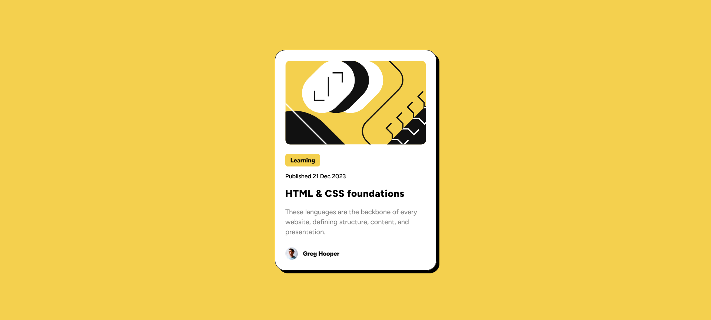

# Frontend Mentor - Blog preview card solution

This is a solution to the [Blog preview card challenge on Frontend Mentor](https://www.frontendmentor.io/challenges/blog-preview-card-ckPaj01IcS). Frontend Mentor challenges help you improve your coding skills by building realistic projects.

## Table of contents

- [Overview](#overview)
    - [The challenge](#the-challenge)
    - [Screenshot](#screenshot)
    - [Links](#links)
- [My process](#my-process)
    - [Built with](#built-with)
    - [What I learned](#what-i-learned)
    - [Continued development](#continued-development)
    - [Useful resources](#useful-resources)
- [Author](#author)

## Overview

### The challenge

Users should be able to:

- See hover and focus states for all interactive elements on the page

### Screenshot



### Links

- Solution URL: [Add solution URL here](https://github.com/ashap-bappy/blog-preview-card-main)
- Live Site URL: [Add live site URL here](https://ashap-bappy.github.io/blog-preview-card-main/)

## My process

### Built with

- Semantic HTML5 markup
- CSS custom properties
- Flexbox
- Font styles

### What I learned

The major learning from this challenge was to match the font styles. I've learned properties like letter-spacing, line-height but never used them. I also used flex gap property and box-shadow. I also learned to use PerfectPixel chrome extension to make the design more perfect.

To see how you can add code snippets, see below:

```css
.description {
  margin-top: 15px;
  color: hsl(0, 0%, 50%);
  font-size: smaller;
  letter-spacing: .005em;
  line-height: 1.5;
}
```

### Continued development

I want to learn more about box-shadow, font styles and also wants to be more comfortable on using flexbox.

### Useful resources

- [PerfectPixel](https://chromewebstore.google.com/detail/perfectpixel-by-welldonec/dkaagdgjmgdmbnecmcefdhjekcoceebi?hl=en) - This helped me for making my design perfect reason. I really liked this extension and will use it going forward.
- [Box-Shadow by Kevin Powell](https://www.youtube.com/watch?v=-JNRQ5HjNeI) - This is an amazing tutorial which helped me finally understand box-shadow. I'd recommend it to anyone still learning this concept.

## Author

- Frontend Mentor - [@ashap-bappy](https://www.frontendmentor.io/profile/ashap-bappy)

